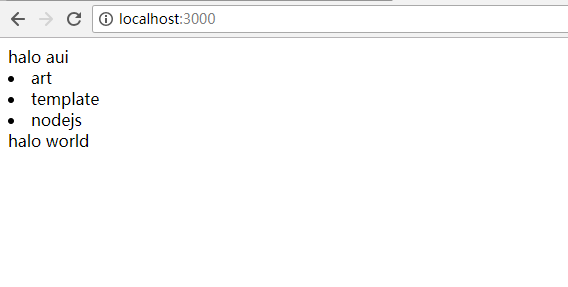

# express-artTemplate
express+artTemplate方案开发node

## 演示

``` bash

# 拉取代码
https://github.com/evinLiang/express-artTemplate.git

# 进入项目文件夹
cd express-artTemplate

# 安装依赖
npm install && cnpm install

# 运行
npm start => `http://localhost:3000` 
```

## 步骤记录
``` bash
# 新建目录
mkdir express-artTemplate

#创建 package.json
npm init -y

#新建入口文件 app.js
touch app.js

#package.json设置npm启动app.js
"scripts": {
    "start": "node app.js"
},

#安装express
npm install express --save

#安装 art-template for express
npm install --save art-template
npm install --save express-art-template

#新建`路由`文件夹 //路由文件名后缀为js
mkdir routes

#新建`视图/模板`文件夹 //路由文件名后缀为html
mkdir views

#app.js设置
var express = require('express');	//引入express
var app = express();
var indexRouter = require('./routes/index');	//引入路由文件：indexRouter
app.use('/', indexRouter);//使用路由indexRouter,使用路由indexRouter指向`/`

//使用art-template作为模板,设置html结尾为模板文件
app.engine('html', require('express-art-template'));
app.set('view options', {
    debug: process.env.NODE_ENV !== 'production'
});

var server = app.listen(3000) //监听3000端口

#新建index.js路由文件
touch /routes/index.js

#index.js设置路由内容
var express = require('express');
var router = express.Router();

// '/'的get 路由
router.get('/', function(req, res, next) {
  	
  	//指向index.html模板，并且设置data 
  	res.render('index.html', {
		user: {
			name: 'aui',
			tags: ['art', 'template', 'nodejs']
		}
	});
});

module.exports = router;

#新建index.html、head.html模板文件
touch /views/index.html || touch /views/head.html

#index.html页面内容
<!DOCTYPE html>
<html lang="en">
  <head>
    <meta charset="utf-8">
    <meta name="viewport" content="width=device-width, initial-scale=1.0, maximum-scale=1.0, user-scalable=0">
    <title>APP</title>
  </head>
  <body>
    <div id="app">
    	{{include './head.html'}}
    	{{each user.tags}}
	        <li>{{$value}}</li>
	    {{/each}}
	    <%
		  include('./head.html', {
		    user: {name: 'world'}
		  });
		%>
    </div>
  </body>
</html>

#head.html页面内容
halo {{user.name}}

#运行
npm start

```
## 效果演示
